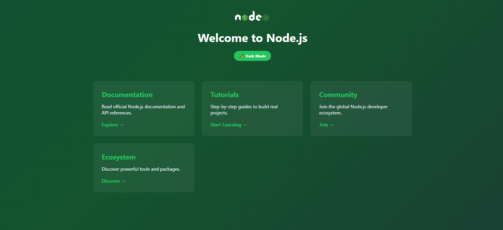

# Node.js Welcome Page

This project shows a welcome page for Node.js with animated background and dark/light mode.

## Preview

## How to run locally

1. Clone the repo  
2. Run `node server.js`  
3. Open [http://localhost:3000](http://localhost:3000) in your browser